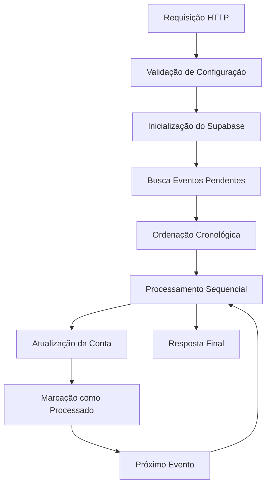

# Edge Function: asaas_event_processor

## 📋 Visão Geral

A Edge Function `asaas_event_processor` é responsável pelo processamento assíncrono de eventos de webhook do Asaas. Esta função processa eventos enfileirados de forma sequencial e ordenada, garantindo que as atualizações de conta sejam aplicadas na ordem cronológica correta.

## 🎯 Objetivo

Processar eventos de webhook do Asaas de forma assíncrona, sequencial e ordenada, aplicando atualizações nas contas conforme os eventos recebidos e mantendo a integridade dos dados.

## 🔧 Arquitetura

### Módulos Utilizados
- **Configuração**: `loadConfig`, `validateConfig`
- **Logging**: `createLogger` com níveis estruturados
- **Tratamento de Erros**: `withErrorHandling` para captura global
- **Helpers**: `createSuccessResponse`, `createInternalErrorResponse`

### Fluxo de Execução



## 📥 Entrada (Request)

### Método HTTP
```
POST /functions/v1/asaas_event_processor
```

### Headers
```
Content-Type: application/json
```

### Payload
```typescript
// Nenhum payload específico necessário
// A função busca eventos pendentes automaticamente
{}
```

### Exemplo de Requisição
```bash
curl -X POST https://your-project.supabase.co/functions/v1/asaas_event_processor \
  -H "Content-Type: application/json" \
  -d '{}'
```

## 📤 Saída (Response)

### Sucesso (200)
```typescript
interface SuccessResponse {
  message: string;
  processed: number;
  success: number;
  errors: number;
  results: Array<{
    event_id: string;
    webhook_event: string;
    success: boolean;
    error?: string;
  }>;
}
```

### Exemplo de Resposta de Sucesso
```json
{
  "success": true,
  "message": "Processamento concluído. Total: 5, Sucesso: 4, Erros: 1",
  "data": {
    "processed": 5,
    "success": 4,
    "errors": 1,
    "results": [
      {
        "event_id": "evt_123456789",
        "webhook_event": "ACCOUNT_STATUS_UPDATED",
        "success": true
      },
      {
        "event_id": "evt_987654321",
        "webhook_event": "ACCOUNT_APPROVED",
        "success": true
      },
      {
        "event_id": "evt_555666777",
        "webhook_event": "ACCOUNT_REJECTED",
        "success": false,
        "error": "Conta não encontrada"
      }
    ]
  }
}
```

### Nenhum Evento Pendente (200)
```json
{
  "success": true,
  "message": "Nenhum evento pendente para processar",
  "data": {
    "processed": 0,
    "success": 0,
    "errors": 0
  }
}
```

### Erros Possíveis

#### 500 - Internal Server Error
```json
{
  "success": false,
  "error": "Erro ao buscar eventos",
  "details": "Falha na conexão com o banco de dados"
}
```

## 🔍 Funções Internas

### `mapEventToAccountUpdate(eventType, eventData)`
Mapeia tipos de eventos para atualizações de conta.

**Parâmetros:**
- `eventType`: Tipo do evento (ex: 'ACCOUNT_STATUS_UPDATED')
- `eventData`: Dados do evento

**Retorna:** Objeto com campos para atualização

**Mapeamentos Suportados:**
```typescript
const eventMappings = {
  'ACCOUNT_STATUS_UPDATED': {
    account_status: eventData.status,
    verification_status: eventData.verificationStatus
  },
  'ACCOUNT_APPROVED': {
    account_status: 'ACTIVE',
    verification_status: 'APPROVED'
  },
  'ACCOUNT_REJECTED': {
    account_status: 'SUSPENDED',
    verification_status: 'REJECTED'
  },
  'ACCOUNT_SUSPENDED': {
    account_status: 'SUSPENDED'
  },
  'ACCOUNT_REACTIVATED': {
    account_status: 'ACTIVE'
  }
};
```

### `processEvent(supabase, event, logger)`
Processa um evento individual.

**Parâmetros:**
- `supabase`: Cliente Supabase
- `event`: Dados do evento
- `logger`: Instância do logger

**Retorna:** `ProcessEventResult` com sucesso/erro

**Fluxo:**
1. Busca conta associada ao evento
2. Mapeia evento para atualização
3. Atualiza conta no banco
4. Marca evento como processado
5. Retorna resultado

### `markEventAsError(supabase, eventId, errorMessage, logger)`
Marca um evento como erro no banco.

**Parâmetros:**
- `supabase`: Cliente Supabase
- `eventId`: ID do evento
- `errorMessage`: Mensagem de erro
- `logger`: Instância do logger

**Ações:**
- Incrementa `retry_count`
- Define `processing_error`
- Atualiza `updated_at`

## 📊 Processamento Sequencial

### Ordenação de Eventos
Os eventos são processados em ordem cronológica estrita:

```sql
SELECT * FROM asaas_webhooks 
WHERE processed = false 
  AND retry_count < 3
ORDER BY created_at ASC, id ASC
LIMIT 10;
```

### Garantias de Ordem
- **Cronológica**: Eventos mais antigos processados primeiro
- **Determinística**: ID como critério de desempate
- **Sequencial**: Um evento por vez, sem paralelismo
- **Rastreável**: Logs detalhados da ordem de processamento

### Exemplo de Log de Ordem
```json
{
  "level": "INFO",
  "message": "Eventos encontrados para processamento (ordenados por data)",
  "context": {
    "count": 3,
    "oldestEvent": "2025-01-25T10:00:00Z",
    "newestEvent": "2025-01-25T10:05:00Z",
    "events": [
      {
        "position": 1,
        "id": "evt_123",
        "webhook_event": "ACCOUNT_STATUS_UPDATED",
        "created_at": "2025-01-25T10:00:00Z"
      },
      {
        "position": 2,
        "id": "evt_456",
        "webhook_event": "ACCOUNT_APPROVED",
        "created_at": "2025-01-25T10:03:00Z"
      }
    ]
  }
}
```

## 🔄 Tratamento de Erros e Retry

### Configuração de Retry
```typescript
const MAX_RETRY_COUNT = 3;
const EVENT_BATCH_SIZE = 10;
```

### Cenários de Erro
1. **Conta não encontrada**: Evento marcado como erro
2. **Erro de atualização**: Retry automático até limite
3. **Erro de parsing**: Evento marcado como erro
4. **Erro de conectividade**: Retry automático

### Estrutura de Erro no Banco
```sql
UPDATE asaas_webhooks SET
  retry_count = retry_count + 1,
  processing_error = 'Mensagem de erro',
  updated_at = NOW()
WHERE id = $1;
```

## 📊 Logging Detalhado

### Níveis de Log
- **INFO**: Fluxo normal e estatísticas
- **WARN**: Eventos com erro (retry possível)
- **ERROR**: Erros críticos de processamento

### Contexto de Processamento
```json
{
  "level": "INFO",
  "message": "Processando evento em sequência",
  "context": {
    "position": "2/5",
    "eventId": "evt_123456789",
    "webhookEvent": "ACCOUNT_STATUS_UPDATED",
    "createdAt": "2025-01-25T10:00:00Z",
    "retryCount": 0
  }
}
```

### Resumo Final
```json
{
  "level": "INFO",
  "message": "Processamento concluído com ordem cronológica",
  "context": {
    "total": 5,
    "success": 4,
    "errors": 1,
    "durationMs": 2500,
    "oldestProcessed": "2025-01-25T10:00:00Z",
    "newestProcessed": "2025-01-25T10:05:00Z",
    "processingOrder": "Eventos processados do mais antigo para o mais recente"
  }
}
```

## 🗄️ Banco de Dados

### Tabela: `asaas_webhooks`
Estrutura dos eventos processados:

```sql
CREATE TABLE asaas_webhooks (
  id UUID PRIMARY KEY DEFAULT gen_random_uuid(),
  asaas_account_id UUID REFERENCES asaas_accounts(id),
  webhook_event TEXT NOT NULL,
  webhook_data JSONB,
  processed BOOLEAN DEFAULT false,
  processed_at TIMESTAMPTZ,
  processing_error TEXT,
  retry_count INTEGER DEFAULT 0,
  signature_valid BOOLEAN,
  raw_payload TEXT,
  created_at TIMESTAMPTZ DEFAULT NOW(),
  updated_at TIMESTAMPTZ DEFAULT NOW()
);
```

### Tabela: `asaas_accounts`
Campos atualizados pelo processamento:

```sql
UPDATE asaas_accounts SET
  account_status = $1,
  verification_status = $2,
  onboarding_status = $3,
  last_webhook_event = $4,
  last_webhook_received_at = $5,
  updated_at = NOW()
WHERE id = $6;
```

## 🔗 Integrações

### Views Utilizadas
- `view_asaas_webhook_events`: Consulta de eventos com contexto
- `view_asaas_webhook_logs`: Logs formatados para frontend

### Exemplo de Consulta de Eventos Pendentes
```sql
SELECT 
  id,
  asaas_account_id,
  webhook_event,
  webhook_data,
  retry_count,
  created_at
FROM asaas_webhooks 
WHERE processed = false 
  AND retry_count < 3
ORDER BY created_at ASC, id ASC
LIMIT 10;
```

## ⚙️ Configuração

### Variáveis de Ambiente
```env
SUPABASE_URL=https://your-project.supabase.co
SUPABASE_SERVICE_ROLE_KEY=your-service-role-key
```

### Constantes Configuráveis
```typescript
const EVENT_BATCH_SIZE = 10;        // Eventos por lote
const MAX_RETRY_COUNT = 3;          // Tentativas máximas
```

## 🧪 Testes

### Teste Manual
```bash
curl -X POST https://your-project.supabase.co/functions/v1/asaas_event_processor \
  -H "Content-Type: application/json" \
  -d '{}'
```

### Casos de Teste
1. **Nenhum evento pendente**: Resposta vazia
2. **Eventos em ordem**: Processamento cronológico
3. **Evento com erro**: Retry e marcação de erro
4. **Conta não encontrada**: Marcação como erro
5. **Limite de retry**: Evento não processado após 3 tentativas
6. **Múltiplos tipos de evento**: Mapeamento correto

## 📊 Monitoramento

### Métricas Importantes
- **Taxa de Sucesso**: % de eventos processados com sucesso
- **Tempo de Processamento**: Duração média por lote
- **Eventos em Retry**: Número de eventos com erro
- **Backlog**: Eventos pendentes de processamento

### Alertas Recomendados
- Taxa de erro > 20%
- Backlog > 100 eventos
- Tempo de processamento > 30 segundos
- Eventos com retry_count = 3

### Dashboard Sugerido
```sql
-- Estatísticas de processamento
SELECT 
  COUNT(*) as total_events,
  COUNT(*) FILTER (WHERE processed = true) as processed,
  COUNT(*) FILTER (WHERE processed = false) as pending,
  COUNT(*) FILTER (WHERE retry_count >= 3) as failed,
  AVG(retry_count) as avg_retries
FROM asaas_webhooks
WHERE created_at >= NOW() - INTERVAL '24 hours';
```

## 🚀 Otimizações

### Performance
- **Batch Processing**: Processa até 10 eventos por execução
- **Índices**: Otimizados para consultas de eventos pendentes
- **Ordem Determinística**: Evita deadlocks em processamento paralelo

### Escalabilidade
- **Processamento Assíncrono**: Não bloqueia webhooks
- **Retry Automático**: Recuperação de falhas temporárias
- **Limite de Batch**: Evita timeouts em lotes grandes

## 🔄 Versionamento

### Versão Atual: 2.0
- ✅ Processamento sequencial ordenado
- ✅ Logging estruturado detalhado
- ✅ Tratamento robusto de erros
- ✅ Retry automático configurável
- ✅ Métricas de processamento

### Changelog
- **v2.0**: Refatoração completa com ordem cronológica garantida
- **v1.0**: Implementação inicial

## 📚 Dependências

### Módulos Compartilhados
- `_shared/config.ts`: Configuração centralizada
- `_shared/logger.ts`: Sistema de logging
- `_shared/error-handling.ts`: Tratamento de erros
- `_shared/response-helpers.ts`: Helpers de resposta

### Bibliotecas Externas
- `@supabase/supabase-js@2.7.1`: Cliente Supabase
- `https://deno.land/std@0.177.0/http/server.ts`: Servidor HTTP

## 🤝 Contribuição

Para modificar esta função:
1. Mantenha o processamento sequencial
2. Preserve a ordem cronológica
3. Adicione logs estruturados
4. Implemente testes de ordem
5. Monitore métricas de performance
6. Atualize esta documentação

---

**Última atualização**: 2025-01-25  
**Autor**: Sistema de Integração Asaas  
**Versão**: 2.0
