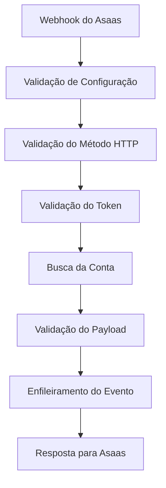

# Edge Function: asaas_webhook_account_status

## 📋 Visão Geral

A Edge Function `asaas_webhook_account_status` é responsável por receber e processar webhooks de mudança de status de conta enviados pela plataforma Asaas. Esta função atua como endpoint de entrada para eventos assíncronos, enfileirando-os para processamento posterior.

## 🎯 Objetivo

Receber webhooks do Asaas de forma segura e confiável, validar a autenticidade dos eventos, e enfileirá-los para processamento assíncrono pelo `asaas_event_processor`.

## 🔧 Arquitetura

### Módulos Utilizados
- **Configuração**: `loadConfig`, `validateConfig`
- **Logging**: `createLogger` com níveis estruturados
- **Tratamento de Erros**: `withErrorHandling` para captura global
- **Helpers**: `parseRequestBody`, `validateRequiredFields`
- **Respostas**: `createSuccessResponse`, `createInternalErrorResponse`

### Fluxo de Execução



## 📥 Entrada (Request)

### Método HTTP
```
POST /functions/v1/asaas_webhook_account_status
```

### Headers Obrigatórios
```
asaas-access-token: <WEBHOOK_TOKEN>
Content-Type: application/json
```

### Payload
```typescript
interface GenericAsaasWebhookPayload {
  id: string;           // ID do evento Asaas (evt_...)
  event: string;        // Tipo do evento
  [key: string]: any;   // Campos adicionais específicos do evento
}
```

### Exemplo de Requisição
```json
{
  "id": "evt_123456789",
  "event": "ACCOUNT_STATUS_UPDATED",
  "account": {
    "id": "acc_987654321",
    "status": "ACTIVE",
    "verificationStatus": "APPROVED"
  },
  "dateCreated": "2025-01-25T10:30:00Z"
}
```

## 📤 Saída (Response)

### Sucesso (200)
```typescript
interface SuccessResponse {
  message: string;
  eventId: string;
  eventType: string;
  status: string;
  timestamp: string;
}
```

### Exemplo de Resposta de Sucesso
```json
{
  "success": true,
  "message": "Webhook recebido e enfileirado com sucesso",
  "data": {
    "eventId": "evt_123456789",
    "eventType": "ACCOUNT_STATUS_UPDATED",
    "status": "ENQUEUED",
    "timestamp": "2025-01-25T10:30:00Z"
  }
}
```

### Evento Duplicado (200)
```json
{
  "success": true,
  "message": "Evento já foi recebido e processado",
  "data": {
    "eventId": "evt_123456789",
    "status": "DUPLICATE"
  }
}
```

### Erros Possíveis

#### 400 - Validation Error
```json
{
  "success": false,
  "error": "Payload inválido",
  "details": "Campos obrigatórios: id, event"
}
```

#### 401 - Unauthorized
```json
{
  "success": false,
  "error": "Token de autenticação ausente",
  "details": "Header asaas-access-token é obrigatório"
}
```

#### 403 - Forbidden
```json
{
  "success": false,
  "error": "Token de autenticação inválido",
  "details": "Token não encontrado ou inválido"
}
```

#### 405 - Method Not Allowed
```json
{
  "success": false,
  "error": "Método não permitido",
  "details": "Apenas método POST é aceito"
}
```

#### 410 - Gone
```json
{
  "success": false,
  "error": "Conta cancelada",
  "details": "Esta conta foi cancelada e não pode receber webhooks"
}
```

#### 500 - Internal Server Error
```json
{
  "success": false,
  "error": "Erro ao processar webhook",
  "details": "Não foi possível enfileirar o evento"
}
```

## 🔐 Segurança

### Autenticação por Token
- **Header**: `asaas-access-token`
- **Validação**: Token deve existir na tabela `asaas_accounts`
- **Formato**: UUID gerado durante criação da conta
- **Unicidade**: Cada conta possui token único

### Validações de Segurança
```typescript
// Validação de formato
if (webhookToken.length < 10) {
  return createInternalErrorResponse(
    'Token de autenticação inválido',
    'Formato de token inválido'
  );
}

// Validação de existência
const { data: accountsData } = await supabase
  .from('asaas_accounts')
  .select('id, profile_id, webhook_token, account_status')
  .eq('webhook_token', webhookToken)
  .not('webhook_token', 'is', null);
```

### Tratamento de Tokens Duplicados
```typescript
if (accountsData.length > 1) {
  logger.warn('Múltiplas contas encontradas para o mesmo token', {
    accountCount: accountsData.length,
    accountIds: accountsData.map(acc => acc.id)
  });
  return createInternalErrorResponse(
    'Token de autenticação ambíguo',
    'Múltiplas contas encontradas para o token'
  );
}
```

### Validação de Status da Conta
```typescript
if (accountData.account_status === 'CANCELLED') {
  return createInternalErrorResponse(
    'Conta cancelada',
    'Esta conta foi cancelada e não pode receber webhooks'
  );
}
```

## 📊 Logging Detalhado

### Níveis de Log
- **INFO**: Fluxo normal de recebimento
- **WARN**: Situações de atenção (duplicados, tokens ambíguos)
- **ERROR**: Erros de processamento

### Contexto de Log
Cada log inclui:
- `requestId`: ID único da requisição
- `eventId`: ID do evento Asaas
- `eventType`: Tipo do evento
- `profileId`: ID do perfil associado
- `tokenPrefix`: Prefixo do token para identificação segura

### Exemplo de Log de Debug
```json
{
  "level": "INFO",
  "message": "DEBUG: Tokens encontrados no banco",
  "context": {
    "requestId": "req_123456789",
    "receivedToken": "f47ac10b-58cc-4372-a567-0e02b2c3d479",
    "receivedTokenLength": 36,
    "accountsFound": 3,
    "tokensInDb": [
      {
        "id": "acc_001",
        "profile_id": "profile_001",
        "tokenPrefix": "f47ac10b...",
        "tokenLength": 36,
        "account_status": "ACTIVE"
      }
    ]
  }
}
```

### Log de Sucesso
```json
{
  "level": "INFO",
  "message": "Webhook processado com sucesso",
  "context": {
    "requestId": "req_123456789",
    "eventId": "evt_123456789",
    "eventType": "ACCOUNT_STATUS_UPDATED",
    "profileId": "profile_001",
    "internalEventId": "internal_001",
    "duration_ms": 250
  }
}
```

## 🗄️ Banco de Dados

### Busca da Conta por Token
```sql
SELECT id, profile_id, webhook_token, account_status
FROM asaas_accounts 
WHERE webhook_token = $1 
  AND webhook_token IS NOT NULL;
```

### Enfileiramento do Evento
```sql
INSERT INTO asaas_webhooks (
  asaas_account_id,
  webhook_event,
  webhook_data,
  processed,
  signature_valid,
  raw_payload,
  created_at
) VALUES (
  $1, $2, $3, false, true, $4, NOW()
);
```

### Estrutura da Tabela `asaas_webhooks`
```sql
CREATE TABLE asaas_webhooks (
  id UUID PRIMARY KEY DEFAULT gen_random_uuid(),
  asaas_account_id UUID REFERENCES asaas_accounts(id),
  webhook_event TEXT NOT NULL,
  webhook_data JSONB,
  processed BOOLEAN DEFAULT false,
  processed_at TIMESTAMPTZ,
  processing_error TEXT,
  retry_count INTEGER DEFAULT 0,
  signature_valid BOOLEAN DEFAULT true,
  raw_payload TEXT,
  created_at TIMESTAMPTZ DEFAULT NOW(),
  updated_at TIMESTAMPTZ DEFAULT NOW()
);
```

## 🔗 Integrações

### Asaas Platform
- **Origem**: Webhooks enviados automaticamente pelo Asaas
- **Frequência**: Baseada em eventos (mudanças de status)
- **Timeout**: Asaas espera resposta em até 30 segundos
- **Retry**: Asaas reenvía em caso de falha

### Event Processor
- **Destino**: Eventos enfileirados são processados pelo `asaas_event_processor`
- **Processamento**: Assíncrono e sequencial
- **Ordem**: Garantida por timestamp de criação

## ⚙️ Configuração

### Variáveis de Ambiente
```env
SUPABASE_URL=https://your-project.supabase.co
SUPABASE_SERVICE_ROLE_KEY=your-service-role-key
```

### Configuração no Asaas
```javascript
// URL do webhook configurada no Asaas
const webhookUrl = "https://your-project.supabase.co/functions/v1/asaas_webhook_account_status";

// Token de autenticação (webhook_token da conta)
const authToken = "f47ac10b-58cc-4372-a567-0e02b2c3d479";
```

## 🧪 Testes

### Teste Manual com curl
```bash
curl -X POST https://your-project.supabase.co/functions/v1/asaas_webhook_account_status \
  -H "asaas-access-token: f47ac10b-58cc-4372-a567-0e02b2c3d479" \
  -H "Content-Type: application/json" \
  -d '{
    "id": "evt_123456789",
    "event": "ACCOUNT_STATUS_UPDATED",
    "account": {
      "id": "acc_987654321",
      "status": "ACTIVE"
    }
  }'
```

### Casos de Teste
1. **Webhook válido**: Evento enfileirado com sucesso
2. **Token ausente**: Erro 401
3. **Token inválido**: Erro 403
4. **Payload inválido**: Erro 400
5. **Método incorreto**: Erro 405
6. **Conta cancelada**: Erro 410
7. **Evento duplicado**: Resposta de duplicado
8. **Múltiplos tokens**: Erro de ambiguidade

### Simulação de Webhook do Asaas
```javascript
// Simular webhook do Asaas
const webhookPayload = {
  id: "evt_" + Date.now(),
  event: "ACCOUNT_STATUS_UPDATED",
  account: {
    id: "acc_123456789",
    status: "ACTIVE",
    verificationStatus: "APPROVED"
  },
  dateCreated: new Date().toISOString()
};
```

## 📊 Monitoramento

### Métricas Importantes
- **Taxa de Recebimento**: Webhooks recebidos por minuto
- **Taxa de Sucesso**: % de webhooks processados com sucesso
- **Tempo de Resposta**: Duração média do processamento
- **Eventos Duplicados**: % de eventos já processados
- **Erros por Tipo**: Distribuição de códigos de erro

### Alertas Recomendados
- Taxa de erro > 5%
- Tempo de resposta > 5 segundos
- Muitos eventos duplicados (possível problema de retry)
- Tokens ambíguos (problema de integridade)

### Dashboard de Webhooks
```sql
-- Estatísticas de webhooks recebidos
SELECT 
  DATE_TRUNC('hour', created_at) as hour,
  COUNT(*) as total_received,
  COUNT(*) FILTER (WHERE processed = true) as processed,
  COUNT(*) FILTER (WHERE processing_error IS NOT NULL) as errors
FROM asaas_webhooks
WHERE created_at >= NOW() - INTERVAL '24 hours'
GROUP BY hour
ORDER BY hour;
```

## 🚨 Troubleshooting

### Problemas Comuns

#### Token não encontrado
```json
{
  "error": "Token de autenticação inválido",
  "solution": "Verificar se o webhook_token existe na tabela asaas_accounts"
}
```

#### Múltiplos tokens
```json
{
  "error": "Token de autenticação ambíguo",
  "solution": "Verificar duplicação de webhook_token na tabela"
}
```

#### Conta cancelada
```json
{
  "error": "Conta cancelada",
  "solution": "Remover webhook no Asaas ou reativar conta"
}
```

### Logs de Debug
Para debugging, a função inclui logs detalhados:
```typescript
logger.info('DEBUG: Tokens encontrados no banco', {
  receivedToken: webhookToken,
  accountsFound: allAccounts.length,
  tokensInDb: allAccounts.map(acc => ({
    tokenPrefix: acc.webhook_token.substring(0, 8) + '...',
    account_status: acc.account_status
  }))
});
```

## 🔄 Versionamento

### Versão Atual: 2.0
- ✅ Validação robusta de tokens
- ✅ Tratamento de tokens duplicados
- ✅ Logging estruturado detalhado
- ✅ Validação de status da conta
- ✅ Detecção de eventos duplicados

### Changelog
- **v2.0**: Refatoração completa com validações robustas
- **v1.0**: Implementação inicial

## 📚 Dependências

### Módulos Compartilhados
- `_shared/config.ts`: Configuração centralizada
- `_shared/logger.ts`: Sistema de logging
- `_shared/error-handling.ts`: Tratamento de erros
- `_shared/response-helpers.ts`: Helpers de resposta

### Bibliotecas Externas
- `@supabase/supabase-js@2.7.1`: Cliente Supabase
- `https://deno.land/std@0.177.0/http/server.ts`: Servidor HTTP

## 🤝 Contribuição

Para modificar esta função:
1. Mantenha as validações de segurança
2. Preserve o logging detalhado
3. Trate todos os cenários de erro
4. Mantenha compatibilidade com Asaas
5. Implemente testes adequados
6. Atualize esta documentação

---

**Última atualização**: 2025-01-25  
**Autor**: Sistema de Integração Asaas  
**Versão**: 2.0
