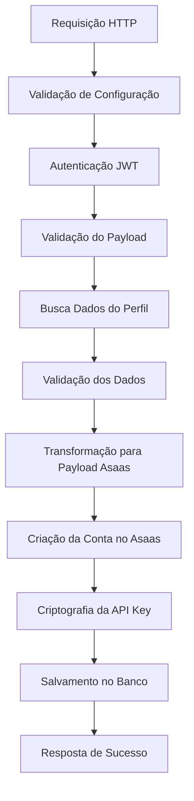

# Edge Function: asaas_account_create

## 📋 Visão Geral

A Edge Function `asaas_account_create` é responsável por criar uma nova conta de cliente (subconta) na plataforma Asaas. Esta função foi refatorada para usar arquitetura modular e princípios de código limpo, garantindo alta confiabilidade e manutenibilidade.

## 🎯 Objetivo

Criar contas Asaas para perfis aprovados no sistema, configurando webhooks, criptografando dados sensíveis e mantendo sincronização entre o banco de dados local e a API do Asaas.

## 🔧 Arquitetura

### Módulos Utilizados
- **Configuração**: `loadConfig`, `validateConfig`
- **Logging**: `createLogger` com níveis estruturados
- **Autenticação**: `authMiddleware` para validação JWT
- **Asaas Client**: `createAsaasClient` para comunicação com API
- **Transformação**: `transformProfileToAsaasPayload` para conversão de dados
- **Segurança**: `encryptApiKey` para criptografia de chaves
- **Tratamento de Erros**: `withErrorHandling` para captura global

### Fluxo de Execução



## 📥 Entrada (Request)

### Método HTTP
```
POST /functions/v1/asaas_account_create
```

### Headers Obrigatórios
```
Authorization: Bearer <JWT_TOKEN>
Content-Type: application/json
```

### Payload
```typescript
interface RequestPayload {
  profile_id: string;              // UUID do perfil
  profile_type: 'INDIVIDUAL' | 'ORGANIZATION';  // Tipo do perfil
}
```

### Exemplo de Requisição
```json
{
  "profile_id": "550e8400-e29b-41d4-a716-446655440000",
  "profile_type": "INDIVIDUAL"
}
```

## 📤 Saída (Response)

### Sucesso (200)
```typescript
interface SuccessResponse {
  profile_id: string;
  profile_type: string;
  asaas_account_id: string;
  wallet_id: string;
  account_status: string;
  onboarding_status: string;
  verification_status: string;
  webhook_urls: {
    account_status: string;
    transfer_status: string;
  };
  webhook_token: string;
  account_data: object;
}
```

### Exemplo de Resposta de Sucesso
```json
{
  "success": true,
  "message": "Conta criada com sucesso no Asaas",
  "data": {
    "profile_id": "550e8400-e29b-41d4-a716-446655440000",
    "profile_type": "INDIVIDUAL",
    "asaas_account_id": "acc_123456789",
    "wallet_id": "wallet_987654321",
    "account_status": "PENDING",
    "onboarding_status": "PENDING",
    "verification_status": "AWAITING_DOCUMENTATION",
    "webhook_urls": {
      "account_status": "https://api.tricket.com.br/functions/v1/asaas_webhook_account_status",
      "transfer_status": "https://api.tricket.com.br/functions/v1/asaas_webhook_transfer_status"
    },
    "webhook_token": "f47ac10b-58cc-4372-a567-0e02b2c3d479",
    "account_data": {
      "id": "550e8400-e29b-41d4-a716-446655440001",
      "created_at": "2025-01-25T10:30:00Z"
    }
  }
}
```

### Erros Possíveis

#### 400 - Validation Error
```json
{
  "success": false,
  "error": "Dados de entrada inválidos",
  "details": "Campo profile_id é obrigatório"
}
```

#### 401 - Unauthorized
```json
{
  "success": false,
  "error": "Token de autenticação inválido ou expirado"
}
```

#### 404 - Not Found
```json
{
  "success": false,
  "error": "Perfil não encontrado",
  "details": "Perfil com ID especificado não existe"
}
```

#### 500 - Internal Server Error
```json
{
  "success": false,
  "error": "Erro interno do servidor",
  "details": "Falha ao criar conta no Asaas",
  "error_id": "error_123456789"
}
```

## 🔍 Funções Internas

### `fetchProfileData(supabase, profileId, logger)`
Busca dados do perfil na view `view_admin_profile_approval`.

**Parâmetros:**
- `supabase`: Cliente Supabase
- `profileId`: UUID do perfil
- `logger`: Instância do logger

**Retorna:** `ProfileViewData` com dados do perfil

### `saveAccountData(supabase, profileId, asaasAccountData, encryptedApiKey, webhookAuthToken, logger)`
Salva dados da conta criada no banco de dados.

**Parâmetros:**
- `supabase`: Cliente Supabase
- `profileId`: UUID do perfil
- `asaasAccountData`: Dados retornados pela API Asaas
- `encryptedApiKey`: API Key criptografada
- `webhookAuthToken`: Token de autenticação do webhook
- `logger`: Instância do logger

**Retorna:** Dados da conta salva no banco

## 🔐 Segurança

### Autenticação
- **JWT Token**: Validação obrigatória via `authMiddleware`
- **Roles**: Verificação de permissões de usuário

### Criptografia
- **API Key**: Criptografada usando `encryptApiKey` com `ENCRYPTION_SECRET`
- **Webhook Token**: UUID gerado para autenticação de webhooks

### Validação
- **Payload**: Validação rigorosa de campos obrigatórios
- **Profile Data**: Validação de dados do perfil via `validateProfileData`

## 📊 Logging

### Níveis de Log
- **INFO**: Fluxo normal de execução
- **WARN**: Situações de atenção
- **ERROR**: Erros recuperáveis
- **CRITICAL**: Erros críticos do sistema

### Contexto de Log
Cada log inclui:
- `requestId`: ID único da requisição
- `profileId`: ID do perfil sendo processado
- `timestamp`: Data/hora da operação
- `duration_ms`: Duração da operação

### Exemplo de Log
```json
{
  "level": "INFO",
  "message": "Conta criada com sucesso no Asaas",
  "context": {
    "requestId": "req_123456789",
    "profileId": "550e8400-e29b-41d4-a716-446655440000",
    "asaasId": "acc_123456789",
    "duration_ms": 1250
  }
}
```

## 🗄️ Banco de Dados

### Tabela: `asaas_accounts`
Estrutura dos dados salvos:

```sql
INSERT INTO asaas_accounts (
  profile_id,
  asaas_account_id,
  api_key,                    -- Criptografada
  wallet_id,
  webhook_token,              -- UUID para autenticação
  account_status,             -- 'PENDING'
  account_type,               -- 'MERCHANT'
  onboarding_status,          -- 'PENDING'
  verification_status,        -- 'AWAITING_DOCUMENTATION'
  onboarding_data,            -- JSONB com dados do processo
  account_settings            -- JSONB com configurações
);
```

## 🔗 Integrações

### API Asaas
- **Endpoint**: `/v3/accounts`
- **Método**: POST
- **Autenticação**: Master Access Token

### Webhooks Configurados
1. **Account Status**: Notificações de mudança de status da conta
2. **Transfer Status**: Notificações de transferências

### Views Utilizadas
- `view_admin_profile_approval`: Dados de perfis aprovados

## ⚙️ Configuração

### Variáveis de Ambiente
```env
SUPABASE_URL=https://your-project.supabase.co
SUPABASE_SERVICE_ROLE_KEY=your-service-role-key
ASAAS_API_URL=https://api.asaas.com/v3
ASAAS_MASTER_ACCESS_TOKEN=your-master-token
ENCRYPTION_SECRET=your-32-char-secret
API_EXTERNAL_URL=https://your-api.com
```

## 🧪 Testes

### Teste Manual
```bash
curl -X POST https://your-project.supabase.co/functions/v1/asaas_account_create \
  -H "Authorization: Bearer YOUR_JWT_TOKEN" \
  -H "Content-Type: application/json" \
  -d '{
    "profile_id": "550e8400-e29b-41d4-a716-446655440000",
    "profile_type": "INDIVIDUAL"
  }'
```

### Casos de Teste
1. **Sucesso**: Perfil válido e aprovado
2. **Perfil não encontrado**: ID inexistente
3. **Token inválido**: JWT expirado ou malformado
4. **Falha na API Asaas**: Erro de conectividade
5. **Dados inválidos**: Payload malformado

## 🚨 Monitoramento

### Métricas Importantes
- **Taxa de Sucesso**: % de contas criadas com sucesso
- **Tempo de Resposta**: Duração média das requisições
- **Erros por Tipo**: Distribuição de tipos de erro
- **Volume de Requisições**: Número de contas criadas por período

### Alertas Recomendados
- Taxa de erro > 5%
- Tempo de resposta > 10 segundos
- Falhas consecutivas na API Asaas
- Erros de criptografia

## 🔄 Versionamento

### Versão Atual: 2.0
- ✅ Arquitetura modular
- ✅ Logging estruturado
- ✅ Tratamento robusto de erros
- ✅ Validação aprimorada
- ✅ Segurança reforçada

### Changelog
- **v2.0**: Refatoração completa com arquitetura modular
- **v1.0**: Implementação inicial

## 📚 Dependências

### Módulos Compartilhados
- `_shared/config.ts`: Configuração centralizada
- `_shared/logger.ts`: Sistema de logging
- `_shared/auth.ts`: Middleware de autenticação
- `_shared/asaas-client.ts`: Cliente da API Asaas
- `_shared/asaas-payload-transformer.ts`: Transformação de dados
- `_shared/crypto.ts`: Funções de criptografia
- `_shared/error-handling.ts`: Tratamento de erros
- `_shared/response-helpers.ts`: Helpers de resposta

### Bibliotecas Externas
- `@supabase/supabase-js@2.7.1`: Cliente Supabase
- `https://deno.land/std@0.177.0/http/server.ts`: Servidor HTTP

## 🤝 Contribuição

Para modificar esta função:
1. Mantenha a arquitetura modular
2. Adicione logs estruturados
3. Implemente testes adequados
4. Atualize esta documentação
5. Valide com dados reais do Asaas

---

**Última atualização**: 2025-01-25  
**Autor**: Sistema de Integração Asaas  
**Versão**: 2.0
