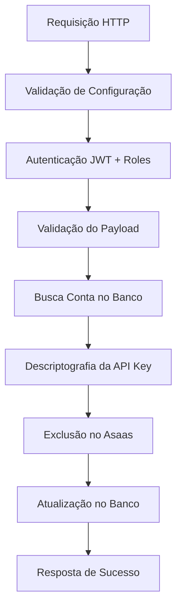

# Edge Function: asaas_account_delete

## 📋 Visão Geral

A Edge Function `asaas_account_delete` é responsável por excluir uma conta de cliente (subconta) na plataforma Asaas. Esta função foi refatorada para usar arquitetura modular e princípios de código limpo, garantindo exclusão segura e rastreável.

## 🎯 Objetivo

Excluir contas Asaas de forma segura, mantendo auditoria completa do processo e sincronização entre o banco de dados local e a API do Asaas.

## 🔧 Arquitetura

### Módulos Utilizados
- **Configuração**: `loadConfig`, `validateConfig`
- **Logging**: `createLogger` com níveis estruturados
- **Autenticação**: `authMiddleware` para validação JWT e roles
- **Segurança**: `decryptApiKey` para descriptografia de chaves
- **Tratamento de Erros**: `withErrorHandling` para captura global
- **Helpers**: `parseRequestBody`, `validateRequiredFields`

### Fluxo de Execução



## 📥 Entrada (Request)

### Método HTTP
```
POST /functions/v1/asaas_account_delete
```

### Headers Obrigatórios
```
Authorization: Bearer <JWT_TOKEN>
Content-Type: application/json
```

### Payload
```typescript
interface DeleteAccountPayload {
  profile_id: string;        // UUID do perfil
  remove_reason: string;     // Motivo da exclusão
}
```

### Exemplo de Requisição
```json
{
  "profile_id": "550e8400-e29b-41d4-a716-446655440000",
  "remove_reason": "Solicitação do cliente"
}
```

## 📤 Saída (Response)

### Sucesso (200)
```typescript
interface SuccessResponse {
  success: true;
  message: string;
  profile_id: string;
  asaas_account_id: string;
  deleted_at: string;
  remove_reason: string;
  asaas_response: object;
}
```

### Exemplo de Resposta de Sucesso
```json
{
  "success": true,
  "message": "Conta excluída com sucesso",
  "profile_id": "550e8400-e29b-41d4-a716-446655440000",
  "asaas_account_id": "acc_123456789",
  "deleted_at": "2025-01-25T10:30:00Z",
  "remove_reason": "Solicitação do cliente",
  "asaas_response": {
    "id": "acc_123456789",
    "status": "DELETED"
  }
}
```

### Sucesso Parcial (200)
```json
{
  "success": true,
  "warning": "Conta excluída no Asaas, mas houve erro ao atualizar banco de dados",
  "asaas_response": {
    "id": "acc_123456789",
    "status": "DELETED"
  },
  "database_error": "Erro específico do banco"
}
```

### Erros Possíveis

#### 400 - Validation Error
```json
{
  "success": false,
  "error": "Campos obrigatórios ausentes",
  "details": "Campos obrigatórios: profile_id, remove_reason"
}
```

#### 401 - Unauthorized
```json
{
  "success": false,
  "error": "Token de autenticação inválido ou expirado"
}
```

#### 403 - Forbidden
```json
{
  "success": false,
  "error": "Acesso negado",
  "details": "Usuário não possui permissão para excluir contas"
}
```

#### 404 - Not Found
```json
{
  "success": false,
  "error": "Conta não encontrada",
  "details": "Nenhuma conta encontrada para o profile_id: 550e8400-e29b-41d4-a716-446655440000"
}
```

#### 500 - Internal Server Error
```json
{
  "success": false,
  "error": "Erro ao excluir conta no Asaas",
  "details": "API retornou erro: Conta não pode ser excluída"
}
```

## 🔐 Segurança

### Autenticação e Autorização
- **JWT Token**: Validação obrigatória via `authMiddleware`
- **Roles Permitidas**: `ADMIN`, `SUPER_ADMIN`
- **Verificação de Permissões**: Validação rigorosa de roles

### Descriptografia
- **API Key**: Descriptografada usando `decryptApiKey` com `ENCRYPTION_SECRET`
- **Validação**: Verificação de existência da API Key antes da descriptografia

### Auditoria
- **Logs Estruturados**: Rastreamento completo da operação
- **Request ID**: Identificador único para cada operação
- **Histórico**: Informações de exclusão salvas no `onboarding_data`

## 📊 Logging

### Níveis de Log
- **INFO**: Fluxo normal de execução
- **WARN**: Situações de atenção (sucesso parcial)
- **ERROR**: Erros recuperáveis
- **CRITICAL**: Erros críticos do sistema

### Contexto de Log
Cada log inclui:
- `requestId`: ID único da requisição
- `profile_id`: ID do perfil sendo processado
- `asaasAccountId`: ID da conta no Asaas
- `duration_ms`: Duração da operação
- `timestamp`: Data/hora da operação

### Exemplo de Log
```json
{
  "level": "INFO",
  "message": "Conta excluída com sucesso no Asaas",
  "context": {
    "requestId": "req_123456789",
    "asaasAccountId": "acc_123456789",
    "responseData": {
      "id": "acc_123456789",
      "status": "DELETED"
    }
  }
}
```

## 🗄️ Banco de Dados

### Busca da Conta
```sql
SELECT * FROM asaas_accounts 
WHERE profile_id = $1
```

### Atualização Após Exclusão
```sql
UPDATE asaas_accounts SET
  account_status = 'CANCELLED',
  updated_at = NOW(),
  onboarding_data = jsonb_set(
    COALESCE(onboarding_data, '{}'),
    '{deleted_at}',
    '"2025-01-25T10:30:00Z"'
  )
WHERE profile_id = $1
```

### Estrutura do `onboarding_data` Após Exclusão
```json
{
  "deleted_at": "2025-01-25T10:30:00Z",
  "delete_reason": "Solicitação do cliente",
  "asaas_response": {
    "id": "acc_123456789",
    "status": "DELETED"
  }
}
```

## 🔗 Integrações

### API Asaas
- **Endpoint**: `/v3/accounts/{accountId}`
- **Método**: DELETE
- **Autenticação**: API Key da conta (descriptografada)

### Exemplo de Requisição para Asaas
```javascript
const response = await fetch(`${config.asaasApiUrl}/accounts/${accountId}`, {
  method: 'DELETE',
  headers: {
    'access_token': decryptedApiKey,
    'Content-Type': 'application/json'
  }
});
```

## ⚙️ Configuração

### Variáveis de Ambiente
```env
SUPABASE_URL=https://your-project.supabase.co
SUPABASE_SERVICE_ROLE_KEY=your-service-role-key
ASAAS_API_URL=https://api.asaas.com/v3
ENCRYPTION_SECRET=your-32-char-secret
```

## 🧪 Testes

### Teste Manual
```bash
curl -X POST https://your-project.supabase.co/functions/v1/asaas_account_delete \
  -H "Authorization: Bearer YOUR_JWT_TOKEN" \
  -H "Content-Type: application/json" \
  -d '{
    "profile_id": "550e8400-e29b-41d4-a716-446655440000",
    "remove_reason": "Solicitação do cliente"
  }'
```

### Casos de Teste
1. **Sucesso Completo**: Exclusão no Asaas e atualização no banco
2. **Sucesso Parcial**: Exclusão no Asaas mas erro no banco
3. **Conta não encontrada**: Profile ID inexistente
4. **Token inválido**: JWT expirado ou malformado
5. **Permissão negada**: Usuário sem role adequada
6. **Falha na API Asaas**: Erro de conectividade ou conta não pode ser excluída
7. **API Key inválida**: Erro na descriptografia

## 🚨 Cenários de Erro

### Tratamento de Erros de Conectividade
```typescript
try {
  asaasResponse = await fetch(asaasUrl, options);
} catch (fetchError) {
  logger.error('Erro na requisição para API do Asaas', {
    requestId,
    error: fetchError.message,
    stack: fetchError.stack
  });
  return createInternalErrorResponse(
    'Erro de conectividade com API do Asaas',
    'Não foi possível conectar com a API do Asaas'
  );
}
```

### Tratamento de Sucesso Parcial
Quando a exclusão no Asaas é bem-sucedida mas a atualização no banco falha:
```typescript
return createSuccessResponse({
  success: true,
  warning: 'Conta excluída no Asaas, mas houve erro ao atualizar banco de dados',
  asaas_response: responseData,
  database_error: updateError.message
});
```

## 🔄 Fluxo de Recuperação

### Em Caso de Falha Parcial
1. **Verificar Status no Asaas**: Confirmar se a conta foi realmente excluída
2. **Tentar Atualização Manual**: Executar UPDATE no banco manualmente
3. **Logs de Auditoria**: Verificar logs para entender o problema

### Rollback (se necessário)
⚠️ **ATENÇÃO**: A exclusão no Asaas é irreversível. Não há rollback automático.

## 📊 Monitoramento

### Métricas Importantes
- **Taxa de Sucesso Completo**: % de exclusões totalmente bem-sucedidas
- **Taxa de Sucesso Parcial**: % de exclusões com problema no banco
- **Tempo de Resposta**: Duração média das operações
- **Erros por Tipo**: Distribuição de tipos de erro

### Alertas Recomendados
- Taxa de sucesso parcial > 10%
- Tempo de resposta > 15 segundos
- Falhas consecutivas na API Asaas
- Erros de descriptografia

## 🔄 Versionamento

### Versão Atual: 2.0
- ✅ Arquitetura modular
- ✅ Autenticação e autorização robustas
- ✅ Logging estruturado
- ✅ Tratamento de sucesso parcial
- ✅ Auditoria completa

### Changelog
- **v2.0**: Refatoração completa com arquitetura modular
- **v1.0**: Implementação inicial

## 📚 Dependências

### Módulos Compartilhados
- `_shared/config.ts`: Configuração centralizada
- `_shared/logger.ts`: Sistema de logging
- `_shared/auth.ts`: Middleware de autenticação
- `_shared/crypto.ts`: Funções de descriptografia
- `_shared/error-handling.ts`: Tratamento de erros
- `_shared/response-helpers.ts`: Helpers de resposta

### Bibliotecas Externas
- `@supabase/supabase-js@2.7.1`: Cliente Supabase
- `https://deno.land/std@0.177.0/http/server.ts`: Servidor HTTP

## 🤝 Contribuição

Para modificar esta função:
1. Mantenha a arquitetura modular
2. Preserve a validação de roles
3. Adicione logs estruturados
4. Trate cenários de sucesso parcial
5. Implemente testes adequados
6. Atualize esta documentação

---

**Última atualização**: 2025-01-25  
**Autor**: Sistema de Integração Asaas  
**Versão**: 2.0
