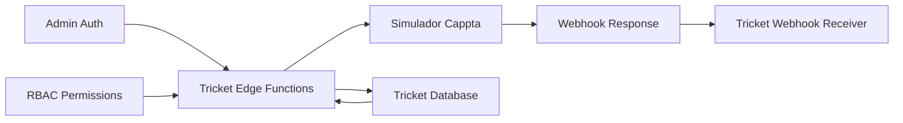

# Changelog - Preparação de Testes de Integração Cappta

**Data:** 2025-08-19 18:00  
**Branch:** `feat/testes-integracao-cappta-simulador`  
**Tipo:** Preparação de Testes  
**Escopo:** Backend, Testes, Configuração  

## Resumo

Preparação completa do ambiente de testes para validar a integração entre o sistema Tricket e o Simulador Cappta deployado no ambiente dev2. Foram implementados cliente HTTP, configurações e suite de testes automatizados.

## Principais Alterações

### 🆕 Novos Arquivos Criados

#### 1. Cliente Cappta para Edge Functions
**Arquivo:** `tricket-backend/volumes/functions/_shared/cappta-client.ts`
- ✅ Cliente HTTP para comunicação com simulador
- ✅ Métodos para webhooks (register/query/inactivate)
- ✅ Métodos para POS devices (create/list)
- ✅ Métodos para merchants e terminals
- ✅ Tratamento de erros e logging integrado
- ✅ Headers de autenticação configurados

#### 2. Suite de Testes Automatizados
**Arquivo:** `tricket-tests/testing/test_cappta_integration.py`
- ✅ Testes de health check do simulador
- ✅ Validação das Edge Functions
- ✅ Testes de webhook manager (register/query/inactivate)
- ✅ Testes de criação de POS devices
- ✅ Testes de fluxo completo de webhooks
- ✅ Relatório automático com taxa de sucesso
- ✅ Tratamento de erros e timeouts

#### 3. Plano de Testes Documentado
**Arquivo:** `tricket-vault/plans/2025-08-19-1800-plano-testes-integracao-cappta-simulador.md`
- ✅ Objetivos e critérios de sucesso definidos
- ✅ Fases de teste estruturadas
- ✅ Comandos de execução documentados
- ✅ Possíveis problemas e soluções

### 🔧 Arquivos Modificados

#### 1. Configuração do Environment Backend
**Arquivo:** `tricket-backend/.env`

**Antes:**
```bash
CAPPTA_API_URL=https://n8n-sv1-wk.kabran.com.br/webhook
```

**Depois:**
```bash
# Cappta - Configuração para usar o Simulador
RESELLER_DOCUMENT=58074056000170
# API Oficial Cappta (para referência)  
# CAPPTA_API_URL=https://pos-portal-stag.cappta.com.br/api/hub
# Simulador Cappta (em uso)
CAPPTA_API_URL=https://simulador-cappta.kabran.com.br
CAPPTA_API_TOKEN=eyJ0eXAiOiJKV1QiLCJhbGciOiJIUzI1NiJ9...
```

**Impacto:** 
- ✅ Tricket agora aponta para o simulador ao invés da API oficial
- ✅ URL oficial mantida comentada para referência
- ✅ Token e documento do revendedor configurados

#### 2. Configuração das Edge Functions
**Arquivo:** `tricket-backend/volumes/functions/_shared/config.ts`

**Adições:**
```typescript
export interface AppConfig {
  // ... outros campos ...
  
  // Cappta
  capptaApiUrl: string;
  capptaApiToken: string;
  resellerDocument: string;
}

const REQUIRED_ENV_VARS = [
  // ... outras vars ...
  'CAPPTA_API_URL',
  'CAPPTA_API_TOKEN', 
  'RESELLER_DOCUMENT',
] as const;
```

**Impacto:**
- ✅ Variáveis Cappta adicionadas à configuração centralizada
- ✅ Validação automática das URLs e tokens
- ✅ Edge Functions podem usar configuração unificada

## Detalhes Técnicos

### Fluxo de Integração Configurado



### APIs Testadas

#### 1. Webhook Management
- `POST /api/webhooks/register` - Registrar webhook
- `GET /api/webhooks/query` - Consultar webhook  
- `POST /api/webhooks/inactivate` - Inativar webhook

#### 2. POS Device Management
- `POST /api/pos-devices` - Criar dispositivo POS
- `GET /api/pos-devices` - Listar dispositivos

#### 3. Health Checks
- `GET /health/ready` - Status do simulador
- `OPTIONS /functions/v1/*` - Status das Edge Functions

### Configurações de Segurança

#### Headers de Autenticação
```typescript
{
  'Content-Type': 'application/json',
  'Authorization': `Bearer ${apiToken}`,
  'User-Agent': 'Tricket-EdgeFunction/1.0'
}
```

#### Validações Implementadas
- ✅ URLs devem ser válidas
- ✅ Tokens devem ter pelo menos 10 caracteres
- ✅ RESELLER_DOCUMENT deve ter pelo menos 14 caracteres
- ✅ Timeouts configurados (10-30 segundos)

### Tratamento de Erros

#### Níveis de Log
- `INFO` - Requisições bem-sucedidas
- `ERROR` - Falhas de comunicação
- `CRITICAL` - Erros inesperados

#### Códigos de Status Tratados
- `200-299` - Sucesso
- `400-499` - Erros de cliente (dados inválidos)
- `500-599` - Erros de servidor
- `Timeout` - Problemas de conectividade

## Testes Implementados

### 1. Health Checks (Básico)
- **Simulador:** `GET /health/ready`
- **Edge Functions:** `OPTIONS /functions/v1/*`

### 2. Autenticação (Intermediário)  
- **Token Admin:** Obtenção e validação
- **RBAC:** Verificação de permissões

### 3. Operações de Negócio (Avançado)
- **Webhook Manager:** Register/Query/Inactivate
- **POS Create:** Criação com payload completo
- **Webhook Flow:** Fluxo end-to-end

### 4. Integração Completa (Crítico)
- **Tricket → Simulador:** Comunicação bidirecional
- **Persistência:** Dados salvos corretamente
- **Logs:** Rastreabilidade completa

## Próximos Passos

### Execução Imediata
1. **Executar Testes:** `python testing/test_captta_integration.py`
2. **Analisar Resultados:** Taxa de sucesso e falhas
3. **Documentar Problemas:** Se houver

### Pós-Testes
1. **Se Sucesso (≥80%):**
   - Commit das alterações
   - Documentar resultados
   - Planejar testes manuais avançados

2. **Se Falha (<80%):**
   - Analisar logs detalhados
   - Corrigir problemas identificados  
   - Re-executar testes

### Desenvolvimento Futuro
1. **Testes Manuais:** Interface web e casos complexos
2. **Performance:** Testes de carga e tempo de resposta
3. **Segurança:** Validação de assinaturas de webhook
4. **Monitoramento:** Alertas e métricas

## Arquivos de Configuração

### Branch Management
```bash
# Branch criada
git checkout -b feat/testes-integracao-cappta-simulador

# Arquivos adicionados
git add tricket-backend/volumes/functions/_shared/cappta-client.ts
git add tricket-tests/testing/test_cappta_integration.py
git add tricket-vault/plans/2025-08-19-1800-*
git add tricket-vault/changelogs/2025-08-19-1800-*

# Arquivos modificados  
git add tricket-backend/.env
git add tricket-backend/volumes/functions/_shared/config.ts
```

### Dependências
- **Python:** `requests` (já presente no ambiente)
- **Deno:** Bibliotecas padrão HTTP
- **Docker:** Simulador Cappta rodando
- **Traefik:** Proxy configurado

## Riscos e Mitigações

### 🟡 Riscos Identificados
1. **Simulador Offline:** Dependência externa
2. **Configuração ENV:** Variáveis podem estar incorretas  
3. **Autenticação:** Tokens podem expirar
4. **Network:** Problemas de conectividade

### ✅ Mitigações Implementadas
1. **Health Checks:** Validação antes dos testes
2. **Timeouts:** Evitam travamentos
3. **Logs Detalhados:** Facilitam diagnóstico  
4. **Tratamento de Erros:** Graceful failure

## Métricas Esperadas

### Performance
- **Tempo de Resposta:** < 2 segundos por requisição
- **Taxa de Sucesso:** ≥ 80% dos testes
- **Availability:** Simulador > 95%

### Funcionalidade  
- **Webhooks:** Register/Query/Inactivate funcionando
- **POS Create:** Criação e persistência
- **Auth:** Tokens e permissões validados

---

**Status:** ✅ Preparação Completa - Pronto para Execução  
**Próxima Etapa:** Execução dos testes automatizados  
**Responsável:** Claude Code  
**Revisão:** Pendente pós-execução dos testes